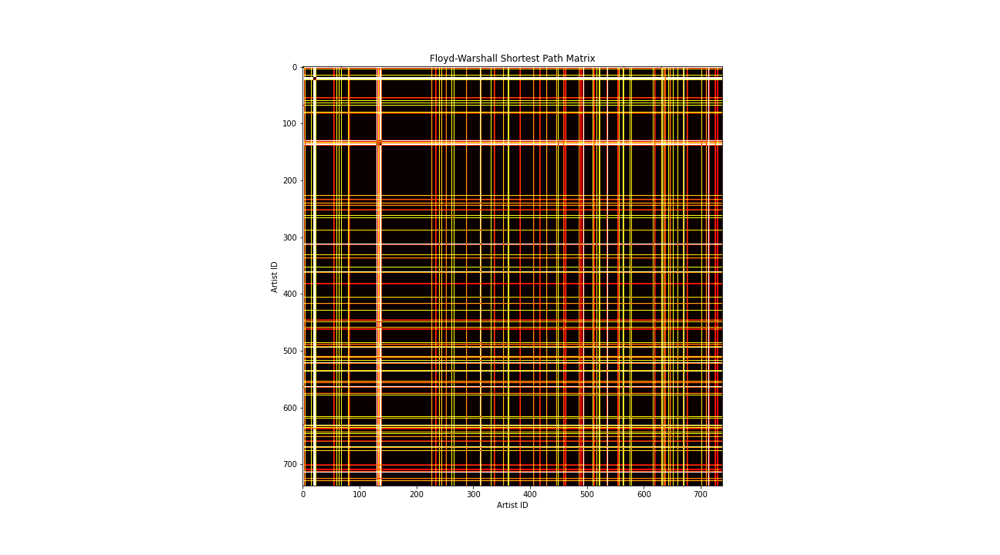

# Results

## Betweenness Centrality and Shortest Paths
Betweenness Centrality is a measure of how many times a node acts as a "bridge" between two points (ie. how many shortest paths run through that node).
To compute betweenness centrality, we first calculated a Floyd-Warshall matrix that contains the shortest distances between any two artists in our graph.

We then use this matrix to determine _if_ a shortest path exists between any two nodes. If it does, then we calculate the shortest path and loop through all nodes along that path.
We store a map that relates these verticies to a custom struct that stores an artists name and their centrality score.

The centrality score determines which artists act as a "bridge" to other artists. This lets us determine if some 

Here are the results:
```
OneRepublic 39316
Nicki Minaj 36999
Frank Ocean 36891
Fifth Harmony 36433
SZA 32627
Kehlani 26672
American Authors 25540
Maroon 5 24223
Kid Quill 23175
Beyoncé 23124
Years & Years 22443
DNCE 22152
Neon Trees 21244
A Great Big World 20533
AJR 19983
Jon Bellion 19858
Sigala 18145
Ellie Goulding 17857
Coldplay 17657
Solange 17521
Christina Perri 16801
Nate Good 16691
Kevin Abstract 16244
Brandy 15935
Bruno Mars 15021
Timeflies 14852
Young Money 14566
New Boyz 14194
Janet Jackson 14085
Nicole Scherzinger 14078
Diplo 13639
Khalid 13419
Michael Jackson 12966
Declan McKenna 12779
lovelytheband 12765
Sean Kingston 12742
HUNNY 12674
Arizona Zervas 12561
MKTO 12365
24kGoldn 12354
Tyla Yaweh 11830
Skizzy Mars 11738
Bryson Tiller 11598
Yeek 11592
Landon Cube 11553
Jessie J 11327
Bazzi 11287
Galantis 11158
Logic 11106
Zara Larsson 10809
Leona Lewis 10797
Cash Cash 10791
Kool & The Gang 10769
Jennifer Lopez 10724
Rick Ross 10706
Night Riots 10697
Dizzy Wright 10614
Grouplove 10576
KYLE 10534
Loud Luxury 10343
Passion Pit 10208
Travis Scott 9992
Zedd 9623
Sia 9610
RL Grime 9356
Ab-Soul 9303
BANNERS 9138
Rihanna 8833
Ella Henderson 8578
Jax Jones 8571
Tory Lanez 8378
Chief Keef 8363
Roy Blair 8355
A$AP Rocky 8331
Troye Sivan 8315
Chloe x Halle 8123
Clean Bandit 8094
Parachute 8005
The Weeknd 7975
Rita Ora 7932
B.o.B 7838
Alex & Sierra 7642
BROCKHAMPTON 7606
Kiana Ledé 7541
Vinyl Theatre 7463
Julia Michaels 7424
The Neighbourhood 7420
Afrojack 7367
Jaymes Young 7365
Chelsea Cutler 7274
Playboi Carti 7239
Seeb 7086
Hozier 7058
FRENSHIP 6933
Anton Powers 6911
Phillip Phillips 6719
Ella Eyre 6522
Aminé 6512
Future 6506
The Fray 6505
Sam Smith 6497
Meltycanon 6478
Chance the Rapper 6444
James Bay 6299
Alessia Cara 6284
Young the Giant 6281
French Montana 6246
Pusha T 6206
Young Nudy 6151
CVBZ 6077
Philip George 6069
COIN 6061
Gunna 5984
NAV 5965
Lost Kings 5936
Bryce Vine 5883
Commodores 5773
Lil Durk 5556
Flume 5497
Kendrick Lamar 5334
Two Door Cinema Club 5265
Atlas Genius 5202
Chiddy Bang 5154
Halsey 5140
Childish Gambino 5129
Calum Scott 5074
Hot Chelle Rae 5065
Anne-Marie 5059
Jason Mraz 4870
Flipp Dinero 4827
Earl Sweatshirt 4757
Luke Christopher 4725
3OH!3 4586
Becky Hill 4534
Doja Cat 4521
Post Malone 4521
Key Glock 4380
Martin Jensen 4380
will.i.am 4334
Tom Odell 4313
Drake 4304
Seafret 4228
Cheat Codes 4225
Ava Max 4204
Rixton 4198
Meghan Trainor 4191
Metro Boomin 4122
Ohio Players 4106
St. Lucia 4067
John Mayer 4050
Tee Grizzley 4039
The Lumineers 4035
DubVision 4012
Noname 4012
Jeremy Zucker 4011
STRFKR 3975
Shawn Mendes 3919
Foster The People 3909
Kash Doll 3884
Dominic Fike 3859
ZAYN 3844
Ra Ra Riot 3817
Ruel 3815
Young Rising Sons 3805
Mabel 3751
rei brown 3751
Jeremih 3656
Casey Veggies 3623
Andy Grammer 3609
The Ready Set 3543
Emeli Sandé 3514
Paloma Faith 3464
2 Chainz 3455
Brooks 3444
Anna Clendening 3427
Gladys Knight & The Pips 3379
Gus Dapperton 3369
The Wombats 3347
Kelly Rowland 3334
Little Mix 3311
WALK THE MOON 3296
Kevin Rudolf 3290
Far East Movement 3263
Coast Modern 3193
The Royal Concept 3177
Ella Vos 3132
Ty Dolla $ign 3129
boy pablo 3089
Camila Cabello 3054
Hoodie Allen 3044
Jess Glynne 3006
MGMT 2991
half•alive 2987
Joey Bada$$ 2976
LMFAO 2952
Mark Ronson 2910
Train 2889
Moosh & Twist 2877
Demi Lovato 2870
Peach Pit 2869
Fergie 2867
Vacation Manor 2866
Maggie Lindemann 2858
Edward Sharpe & The Magnetic Zeros 2849
Lil Wayne 2756
The Script 2755
Sly & The Family Stone 2676
khai dreams 2651
Gym Class Heroes 2645
Watsky 2645
Local Natives 2587
Pop Smoke 2503
Northeast Party House 2492
Trey Songz 2486
G-Eazy 2458
Yo Gotti 2446
Omar Apollo 2380
Clipse 2375
The Drums 2366
August Alsina 2343
Christian French 2337
Donnie Trumpet & The Social Experiment 2323
Disclosure 2305
Matoma 2267
Paris Hilton 2255
Cobra Starship 2234
Kesha 2228
Joywave 2221
Amos Lee 2180
Tierra Whack 2174
SAINt JHN 2158
Ben Howard 2154
Artist Vs Poet 2150
Wallows 2150
EARTHGANG 2144
Of Monsters and Men 2140
Big Sean 2093
J. Cole 2085
Mick Jenkins 2068
Taio Cruz 2061
Travie McCoy 2025
Banes World 2014
Jennifer Hudson 2004
RAYE 1989
Ricky Montgomery 1985
Roddy Ricch 1978
The Jungle Giants 1953
CHIKA 1939
Duke Dumont 1884
Macklemore & Ryan Lewis 1881
Ryan Caraveo 1840
Gavin DeGraw 1838
James TW 1834
Jason Derulo 1831
Joel Corry 1824
Selena Gomez & The Scene 1794
Gorgon City 1777
Lupe Fiasco 1764
gnash 1744
Lauv 1724
Pharrell Williams 1724
Blind Pilot 1691
SonReal 1686
Joey Purp 1680
Nightly 1676
Milky Chance 1661
Broken Bells 1653
Oliver Heldens 1632
A Rocket To The Moon 1622
Saint Motel 1622
Joji 1597
FLETCHER 1577
Carly Rae Jepsen 1571
Katy Perry 1534
Smino 1524
The Walters 1517
Meek Mill 1512
Saba 1512
AJ Mitchell 1511
Colony House 1510
Radical Face 1499
Lute 1497
Her's 1496
Juice WRLD 1482
Zack Villere 1470
Selena Gomez 1464
Phoenix 1457
Charlie Puth 1449
Cardi B 1448
NLE Choppa 1442
EXES 1416
Polo G 1416
Mario 1414
Miley Cyrus 1406
P!nk 1369
UMI 1369
Don Toliver 1361
The Knocks 1357
Usher 1340
Ed Sheeran 1333
Majid Jordan 1310
Patrick Stump 1310
Whitney Houston 1290
Kodak Black 1278
Olly Murs 1273
Vance Joy 1261
The Temptations 1257
Verzache 1250
Stevie Wonder 1249
LANY 1239
Shoffy 1239
Dua Lipa 1230
Washed Out 1229
ScHoolboy Q 1214
Mike Perry 1213
Berhana 1196
Smallpools 1195
Empire of the Sun 1185
Kid Bloom 1177
Miike Snow 1176
Iggy Azalea 1174
Kanye West 1150
Benjamin Francis Leftwich 1137
Bombay Bicycle Club 1135
The Vamps 1131
Chris Webby 1130
DaniLeigh 1127
Raveena 1125
Alexi Murdoch 1122
Hot Flash Heat Wave 1120
Famous Dex 1111
Family of the Year 1105
Craft Spells 1102
Packy 1090
The Pussycat Dolls 1087
Calvin Harris 1084
joan 1076
Madison Beer 1060
Rapsody 1051
James Arthur 1040
Phantogram 1036
Justin Bieber 1034
Young Thug 1027
What So Not 1018
Vince Staples 1014
Imagine Dragons 1009
Internet Money 1005
Liam Payne 992
Megan Thee Stallion 980
Iyaz 970
Cam Meekins 967
Wale 949
Kelly Clarkson 945
Taylor Swift 941
Harry Styles 936
The Honeysticks 928
Phoebe Ryan 922
Choker 919
Hailee Steinfeld 919
Lindsay Lohan 919
Karen Harding 918
Sheck Wes 909
Macklemore 880
DJ Drama 878
Smokey Robinson & The Miracles 876
Brett Dennen 875
Last Dinosaurs 870
MNEK 865
Natasha Bedingfield 859
mansionz 857
Bea Miller 850
Blonde 845
RAC 840
Miguel 836
Penguin Prison 830
Black Eyed Peas 829
21 Savage 800
Matt and Kim 796
One Direction 790
Cavetown 786
Lorde 785
Jamila Woods 782
Mumford & Sons 776
Lizzo 771
Gregory Alan Isakov 770
Miami Horror 769
Mokita 769
Shiloh Dynasty 755
Adele 754
Louis Tomlinson 743
Still Woozy 722
Jukebox The Ghost 721
Yung Heazy 718
Avril Lavigne 717
CRUISR 716
Jazmine Sullivan 715
Jakob Ogawa 705
Kota the Friend 699
Jack Johnson 692
Samsa 690
Five For Fighting 684
Omarion 683
Joe Purdy 678
George Ezra 673
Nick Jonas 671
Sasha Sloan 660
Lil Baby 654
M.O 654
DaBaby 653
Courteeners 651
Robin Thicke 648
Parliament 647
Oliver Tree 643
Cher Lloyd 642
Kid Ink 641
The Meters 638
The Chainsmokers 637
Lloyd 633
Mat Kearney 630
Cold War Kids 628
Wild Party 627
YNW Melly 626
Ski Mask The Slump God 621
H.E.R. 617
MK 615
The Summer Set 609
RICEWINE 608
Alesso 602
I DONT KNOW HOW BUT THEY FOUND ME 601
Robyn 597
Jordan Maxwell 587
Ben Rector 585
Grizfolk 584
Quinn XCII 582
Billie Eilish 580
Girls Aloud 579
The Veronicas 576
Basement Jaxx 574
A R I Z O N A 573
Quintino 572
Four Tops 570
Kygo 569
The Jacksons 566
Funkadelic 565
Lifehouse 565
Brian Fresco 563
Youngblood Hawke 562
Alex Newell 557
Jamie T 557
Alicia Keys 556
David Cook 554
Lady Gaga 552
Gryffin 551
Taylor Bennett 547
Lil Reese 546
MAX 543
Ella Mai 541
Rich The Kid 539
Towkio 537
The Goo Goo Dolls 534
The Head and the Heart 529
Big Time Rush 528
Bastille 527
Aaliyah 520
Qveen Herby 518
Ryan Leslie 509
Ray LaMontagne 508
Dillon Francis 507
No Rome 505
Ekali 504
Futuristic 503
Ollie MN 503
Jay Electronica 502
Niall Horan 500
Chris Brown 494
The Marías 494
Birdman 493
Jessie Reyez 493
L D R U 486
Nicky Romero 477
Takeoff 477
New Politics 472
The Whitest Boy Alive 471
Shy Glizzy 468
CID 461
Scissor Sisters 460
Asian Doll 457
Jonas Blue 455
Madison Mars 454
Pink Guy 452
The Pointer Sisters 450
Stereo Skyline 447
Ariana Grande 446
blackbear 442
The Wanted 440
Curtis Mayfield 434
Witt Lowry 434
Jorja Smith 433
NF 430
DJ Khaled 420
Krewella 418
Lewis Del Mar 416
Cuban Doll 413
Rob Thomas 411
Lucas & Steve 407
Owl City 404
Rhys Lewis 403
Stefflon Don 400
Kid Cudi 398
David Guetta 397
Melanie Martinez 395
Gwen Stefani 394
Caleborate 393
The Mowgli's 393
BOYO 390
Sabrina Claudio 390
Bad Suns 387
Marvin Gaye 385
UnoTheActivist 385
FIL BO RIVA 384
The Downtown Fiction 384
Inner Wave 377
THEY. 377
The Supremes 376
Jamie xx 374
Rae Sremmurd 372
The Academy Is... 372
Jay Sean 358
En Vogue 353
Swae Lee 351
The Isley Brothers 346
Disciples 337
Nick Murphy 330
Luther Vandross 329
Metro Station 329
Fredo Santana 327
Tay-K 325
Colton Dixon 323
No Vacation 322
Bhad Bhabie 319
Wild Nothing 319
SLUMBERJACK 317
Bill Withers 315
Toni Braxton 314
Flo Rida 311
M-22 311
X Ambassadors 311
Nelly Furtado 308
Amir Obe 305
E-Dubble 304
The Horrors 302
PARTYNEXTDOOR 296
James Morrison 294
AlunaGeorge 289
Roy Woods 285
Domo Genesis 282
Heidi Montag 282
Lost Frequencies 281
Matt Champion 279
Wham! 273
Curbi 272
A$AP Mob 271
6LACK 268
Hey Monday 264
Ace Hood 260
Amtrac 257
Dean Lewis 248
Kali Uchis 247
N.E.R.D 243
JP Cooper 240
Anfa Rose 237
Yo Trane 235
Marshmello 234
SBTRKT 233
Keyshia Cole 229
Trisha Paytas 226
VÉRITÉ 226
Starley 225
Flosstradamus 222
Gavin James 220
David Gray 216
Ball Park Music 212
Tom Zanetti 211
Lucidious 207
Keane 200
Fitz and The Tantrums 198
Madeon 190
Jelani Aryeh 187
Ginuwine 183
Ameer Vann 178
The Temper Trap 169
Wax 165
Discovery 163
Peter Bjorn and John 162
Conan Gray 161
Beach Fossils 156
DIIV 154
Wingtip 153
Davai 150
Transviolet 145
Luna Shadows 144
Huey Mack 139
The Pigeon Detectives 139
Hot Chip 136
Tank and The Bangas 136
Sik World 134
Justin Stone 132
Elton John 130
Hellogoodbye 126
IDK 124
Firebeatz 120
Laidback Luke 120
Cute Is What We Aim For 116
Augustana 115
Hootie & The Blowfish 114
sagun 113
The Palmer Squares 112
Wings 111
Panama Wedding 110
T.I. 106
Classixx 102
Flobots 101
The Griswolds 100
mxmtoon 98
Chase Atlantic 97
Goldroom 96
Mounika. 94
Noah And The Whale 94
Kris Allen 90
Lee DeWyze 89
Alison Wonderland 88
Von Wegen Lisbeth 85
The Fratellis 82
Razorlight 81
Daryl Hall & John Oates 77
Lime Cordiale 77
Great Good Fine Ok 72
Bronze Radio Return 67
Band of Horses 66
Kasbo 63
Neon Indian 63
Chicago 60
Alextbh 58
Kyle Dion 57
The Unlikely Candidates 56
San Cisco 53
British India 51
Mellow Fellow 48
Ringo Starr 47
SNBRN 47
Timmies 46
Classified 43
Don Henley 39
Petit Biscuit 38
Spose 38
Steely Dan 38
Mereba 36
Kaskade 35
Tyler The Creator 35
Eagles 34
Odd Future 32
MellowHype 30
The Beatles 29
Fleetwood Mac 27
Billy Joel 26
moow 26
Jagged Edge 24
Steve Winwood 22
Matchbox Twenty 21
Huey Lewis & The News 20
John Lennon 20
Tom Petty and the Heartbreakers 18
Christopher Cross 17
Brooke Hogan 15
Paul McCartney 14
The Doobie Brothers 14
Pitbull 13
Dirty South 12
Jai Wolf 11
Kenny Loggins 11
Kidswaste 11
Steve Miller Band 10
Attom 9
BTS 9
George Harrison 9
Morgan Page 9
Trinix 8
David Bowie 7
EMBRZ 7
Electric Light Orchestra 7
Golden Vessel 7
Sky Sailing 7
Breaking Benjamin 6
Cream 6
Shallou 6
The Rolling Stones 6
Linkin Park 5
Madvillain 5
RM 5
Sundara Karma 5
Talking Heads 5
V 5
Catfish and the Bottlemen 4
Eric Nam 4
Limp Bizkit 4
Lou Reed 4
MF DOOM 4
Roxy Music 4
The Beach Boys 4
The Who 4
Blossoms 3
Hoobastank 3
Jimi Hendrix 3
King Geedorah 3
SEVENTEEN 3
Viktor Vaughn 3
Win and Woo 3
BLACKPINK 2
Circa Waves 2
Faces 2
SUNMI 2
T. Rex 2
Three Days Grace 2
KMD 1
Möwe 1
The Animals 1
The Hunna 1
Viola Beach 1
```

As you can see, many popular artists are towards the top of the list, with OneRepublic dominating the competition. This result is expected, because popular artists are
more likely to have relations to other artists from other genres. You'll also notice most of the genres of artists towards the top are pop, and this is most likely
due to the fact that pop has a blend of many other genres (rap, indie, rock, etc.) so it's easy to hop from these artists to others.


### Shortest Path Between Two Artists
We can display the shortest path between two artists. Go ahead and run `make finalproj && ./finalproj` to see an example!
```
Future -> Meek Mill -> Big Sean -> Kanye West -> Kid Cudi
```

### Floyd-Warshall Matrix Visualization


This is a perfectly symmetrical matrix, and for good reason: the shortest path from artist A to artist B is the same as the shortest path from artist B to artist A.
The colors represent the value of the shortest distance between two vertexes.

The Floyd-Warshall algorithm also does something intersting: the values in the matrix is the shortest distance between any two nodes in the graph. This does not tell us the
number of edges between any two nodes in the graph. We can find that out using a Breadth First Traversal / Search, though.

## Breadth First Traversal

Let's start from _Kid Cudi_, and see where our graph takes us:
```
Kid Cudi
Kanye West
ScHoolboy Q
Pusha T
Lupe Fiasco
Big Sean
Kendrick Lamar
A$AP Rocky
J. Cole
Ab-Soul
Clipse
Childish Gambino
N.E.R.D
Jay Electronica
Drake
Meek Mill
2 Chainz
Wale
Rick Ross
Vince Staples
The Weeknd
Travis Scott
Chance the Rapper
Dizzy Wright
Casey Veggies
Joey Bada$$
Pharrell Williams
Frank Ocean
Earl Sweatshirt
Tyler The Creator
Jeremih
Tory Lanez
DJ Drama
French Montana
Future
Yo Gotti
Ty Dolla $ign
DJ Khaled
Lil Wayne
Birdman
Young Money
Ace Hood
MellowHype
Domo Genesis
Miguel
Playboi Carti
Chief Keef
Noname
Donnie Trumpet & The Social Experiment
Logic
Ryan Leslie
Robin Thicke
BROCKHAMPTON
SZA
Kevin Abstract
Odd Future
Mario
Chris Brown
Lloyd
Trey Songz
Bryson Tiller
Kid Ink
T.I.
August Alsina
B.o.B
New Boyz
Majid Jordan
Young Nudy
UnoTheActivist
Lil Durk
Fredo Santana
Lil Reese
Mick Jenkins
Saba
Tierra Whack
Joey Purp
Brian Fresco
G-Eazy
Futuristic
Skizzy Mars
Chris Webby
Omarion
Aminé
Matt Champion
Ameer Vann
Doja Cat
Kehlani
Kiana Ledé
Kali Uchis
H.E.R.
Sabrina Claudio
Dominic Fike
Yeek
Usher
Yo Trane
6LACK
Khalid
PARTYNEXTDOOR
Roy Woods
Travie McCoy
Gym Class Heroes
Chiddy Bang
Kevin Rudolf
Iyaz
Sean Kingston
Gunna
Key Glock
Shy Glizzy
Smino
EARTHGANG
Kota the Friend
IDK
CHIKA
Towkio
Taylor Bennett
Hoodie Allen
KYLE
Huey Mack
Luke Christopher
Moosh & Twist
Cam Meekins
E-Dubble
SonReal
Chloe x Halle
Qveen Herby
Nicki Minaj
Ella Mai
DaniLeigh
Jessie Reyez
Jorja Smith
Choker
Omar Apollo
Meltycanon
Zack Villere
Joji
Ginuwine
Jagged Edge
Bazzi
3OH!3
Cobra Starship
LMFAO
Macklemore & Ryan Lewis
Macklemore
Far East Movement
Jay Sean
Jason Derulo
Taio Cruz
Flo Rida
Bruno Mars
Don Toliver
NAV
Lil Baby
Young Thug
21 Savage
Tee Grizzley
Lute
Caleborate
Tank and The Bangas
Jamila Woods
Rapsody
Mereba
Bryce Vine
Kid Quill
Nate Good
Watsky
Beyoncé
Lizzo
Iggy Azalea
Kash Doll
Fifth Harmony
Rihanna
Megan Thee Stallion
Berhana
UMI
rei brown
Samsa
Verzache
Oliver Tree
Pink Guy
Julia Michaels
Madison Beer
Shawn Mendes
Justin Bieber
The Ready Set
Metro Station
Hey Monday
Hellogoodbye
Patrick Stump
Cute Is What We Aim For
The Academy Is...
Pitbull
Classified
will.i.am
Christina Perri
Olly Murs
Jessie J
Sheck Wes
Metro Boomin
Juice WRLD
Flipp Dinero
Kodak Black
Pop Smoke
A$AP Mob
Takeoff
Roddy Ricch
NLE Choppa
Raveena
Jon Bellion
Christian French
mansionz
blackbear
Packy
Timeflies
Ryan Caraveo
Justin Stone
Lucidious
Witt Lowry
Arizona Zervas
Flobots
The Palmer Squares
Wax
Spose
Solange
Jennifer Lopez
Kelly Rowland
Cardi B
Asian Doll
Bhad Bhabie
Cuban Doll
Hailee Steinfeld
Ariana Grande
Little Mix
Bea Miller
Zara Larsson
Alessia Cara
Demi Lovato
Halsey
Selena Gomez
ZAYN
Meghan Trainor
DNCE
Camila Cabello
Fergie
The Pussycat Dolls
Kyle Dion
Alextbh
khai dreams
Ollie MN
moow
Ava Max
Maggie Lindemann
Ed Sheeran
Liam Payne
Niall Horan
Taylor Swift
Artist Vs Poet
Owl City
Sky Sailing
Hot Chelle Rae
Stereo Skyline
The Downtown Fiction
Black Eyed Peas
Nicole Scherzinger
A Great Big World
Leona Lewis
Kelly Clarkson
The Wanted
Sia
Katy Perry
P!nk
Cher Lloyd
Adele
Post Malone
Famous Dex
Tyla Yaweh
Internet Money
Polo G
DaBaby
YNW Melly
Tay-K
Rich The Kid
AJR
Jeremy Zucker
Quinn XCII
Chelsea Cutler
MKTO
FRENSHIP
Sik World
NF
24kGoldn
Brandy
Jazmine Sullivan
Nelly Furtado
Jennifer Hudson
Alicia Keys
Stefflon Don
One Direction
Rita Ora
Anne-Marie
Ellie Goulding
Harry Styles
Charlie Puth
Sam Smith
Selena Gomez & The Scene
Miley Cyrus
Billie Eilish
Melanie Martinez
Troye Sivan
Dua Lipa
Louis Tomlinson
Rixton
Nick Jonas
Maroon 5
Natasha Bedingfield
Gwen Stefani
Kesha
Shiloh Dynasty
sagun
Timmies
Mabel
Anna Clendening
James TW
James Arthur
The Vamps
The Summer Set
A Rocket To The Moon
Parachute
Paris Hilton
BANNERS
Phillip Phillips
Alex & Sierra
American Authors
Emeli Sandé
Years & Years
Lorde
Rae Sremmurd
Landon Cube
SAINt JHN
Swae Lee
Ski Mask The Slump God
The Unlikely Candidates
COIN
lovelytheband
gnash
Wingtip
CVBZ
FLETCHER
AJ Mitchell
Ella Vos
EXES
A R I Z O N A
Aaliyah
Janet Jackson
Keyshia Cole
Toni Braxton
Whitney Houston
Big Time Rush
Ella Henderson
Jess Glynne
Clean Bandit
Coldplay
MAX
James Bay
Calum Scott
Avril Lavigne
Lady Gaga
Ruel
Carly Rae Jepsen
Jason Mraz
Train
The Script
OneRepublic
The Veronicas
Jordan Maxwell
Becky Hill
M.O
RAYE
Sasha Sloan
JP Cooper
Rhys Lewis
Gavin James
Dean Lewis
Andy Grammer
Augustana
The Fray
Lindsay Lohan
Brooke Hogan
Heidi Montag
Trisha Paytas
Jaymes Young
Seafret
Lee DeWyze
Colton Dixon
David Cook
Kris Allen
Vinyl Theatre
X Ambassadors
Imagine Dragons
Young Rising Sons
Bastille
Paloma Faith
Sigala
Anfa Rose
THEY.
Amir Obe
CRUISR
Colony House
Bad Suns
Night Riots
Smallpools
Vacation Manor
Grizfolk
HUNNY
Lauv
Lost Kings
Phoebe Ryan
Mokita
Luna Shadows
VÉRITÉ
Transviolet
Shoffy
Michael Jackson
En Vogue
Luther Vandross
Ella Eyre
Jax Jones
Tom Odell
Keane
Hozier
George Ezra
John Mayer
Gavin DeGraw
James Morrison
Rob Thomas
Five For Fighting
The Goo Goo Dolls
Matchbox Twenty
Hootie & The Blowfish
Neon Trees
Blonde
Anton Powers
Joel Corry
MNEK
Ben Rector
Mat Kearney
Lifehouse
The Neighbourhood
Panama Wedding
Wild Party
WALK THE MOON
The Royal Concept
Mark Ronson
Starley
Seeb
Mike Perry
Calvin Harris
Kygo
Martin Jensen
Jonas Blue
Cheat Codes
The Mowgli's
Ra Ra Riot
Coast Modern
Joywave
Nightly
joan
half•alive
Declan McKenna
Diplo
LANY
Kool & The Gang
The Pointer Sisters
Wham!
The Jacksons
Loud Luxury
Ben Howard
Vance Joy
The Lumineers
The Head and the Heart
Jack Johnson
Amos Lee
Young the Giant
Grouplove
New Politics
Jukebox The Ghost
Alex Newell
Philip George
Tom Zanetti
Karen Harding
Chase Atlantic
Wallows
Atlas Genius
Fitz and The Tantrums
Youngblood Hawke
Robyn
Girls Aloud
Scissor Sisters
Basement Jaxx
Galantis
Matoma
Gryffin
Lost Frequencies
Marshmello
David Guetta
The Chainsmokers
The Griswolds
STRFKR
Lewis Del Mar
Milky Chance
Saint Motel
No Rome
Ricky Montgomery
I DONT KNOW HOW BUT THEY FOUND ME
The Honeysticks
Roy Blair
Peach Pit
Flosstradamus
RL Grime
Dillon Francis
Ohio Players
Commodores
Benjamin Francis Leftwich
Mumford & Sons
Gregory Alan Isakov
Edward Sharpe & The Magnetic Zeros
Of Monsters and Men
Brett Dennen
Joe Purdy
David Gray
Ray LaMontagne
Foster The People
Cold War Kids
Local Natives
Passion Pit
Matt and Kim
M-22
MK
Gorgon City
Disciples
Duke Dumont
St. Lucia
Cash Cash
Davai
Washed Out
Phantogram
Broken Bells
Neon Indian
Von Wegen Lisbeth
FIL BO RIVA
Conan Gray
Cavetown
mxmtoon
Still Woozy
Kid Bloom
Jelani Aryeh
Gus Dapperton
Hot Flash Heat Wave
The Walters
Alison Wonderland
What So Not
Flume
Ekali
Sly & The Family Stone
Parliament
Gladys Knight & The Pips
The Isley Brothers
Stevie Wonder
Family of the Year
Noah And The Whale
Radical Face
Blind Pilot
Alexi Murdoch
Two Door Cinema Club
Empire of the Sun
MGMT
Discovery
Phoenix
Miike Snow
Disclosure
The Knocks
RAC
Goldroom
Penguin Prison
Zedd
Krewella
Craft Spells
Mounika.
The Marías
BOYO
Inner Wave
boy pablo
No Vacation
Jakob Ogawa
SLUMBERJACK
L D R U
Northeast Party House
The Jungle Giants
The Meters
Curtis Mayfield
Bill Withers
Funkadelic
The Temptations
Marvin Gaye
Smokey Robinson & The Miracles
Bronze Radio Return
Band of Horses
The Temper Trap
Bombay Bicycle Club
The Wombats
Miami Horror
The Drums
Peter Bjorn and John
The Whitest Boy Alive
Hot Chip
SBTRKT
Jamie xx
AlunaGeorge
Amtrac
Great Good Fine Ok
Classixx
Madeon
Afrojack
Alesso
Wild Nothing
Beach Fossils
Banes World
RICEWINE
Nick Murphy
Ball Park Music
San Cisco
Last Dinosaurs
Lime Cordiale
The Supremes
Four Tops
Jamie T
Razorlight
The Fratellis
The Pigeon Detectives
Courteeners
DIIV
The Horrors
Firebeatz
DubVision
Laidback Luke
Nicky Romero
Quintino
Her's
British India
Brooks
Yung Heazy
Oliver Heldens
Madison Mars
Lucas & Steve
Mellow Fellow
Curbi
CID
```

As you can see, the traversal starts with artists that are related to Kid Cudi, and has more rappers towards the top. As the list goes on, however,
we start to see other genres blending in. Eventually, we make it out of the rap genre and start to enter alt rock / indie, and start moving further and
further away from artists that are similar to what we started with.

What's also important to note is that this traversal does not cover the entire graph, but rather connected components within the entire graph. Some artists that
you start with (for example: Quasimoto), will only give you a short traversal.
```
Quasimoto
Viktor Vaughn
King Geedorah
KMD
Madvillain
MF DOOM
```
